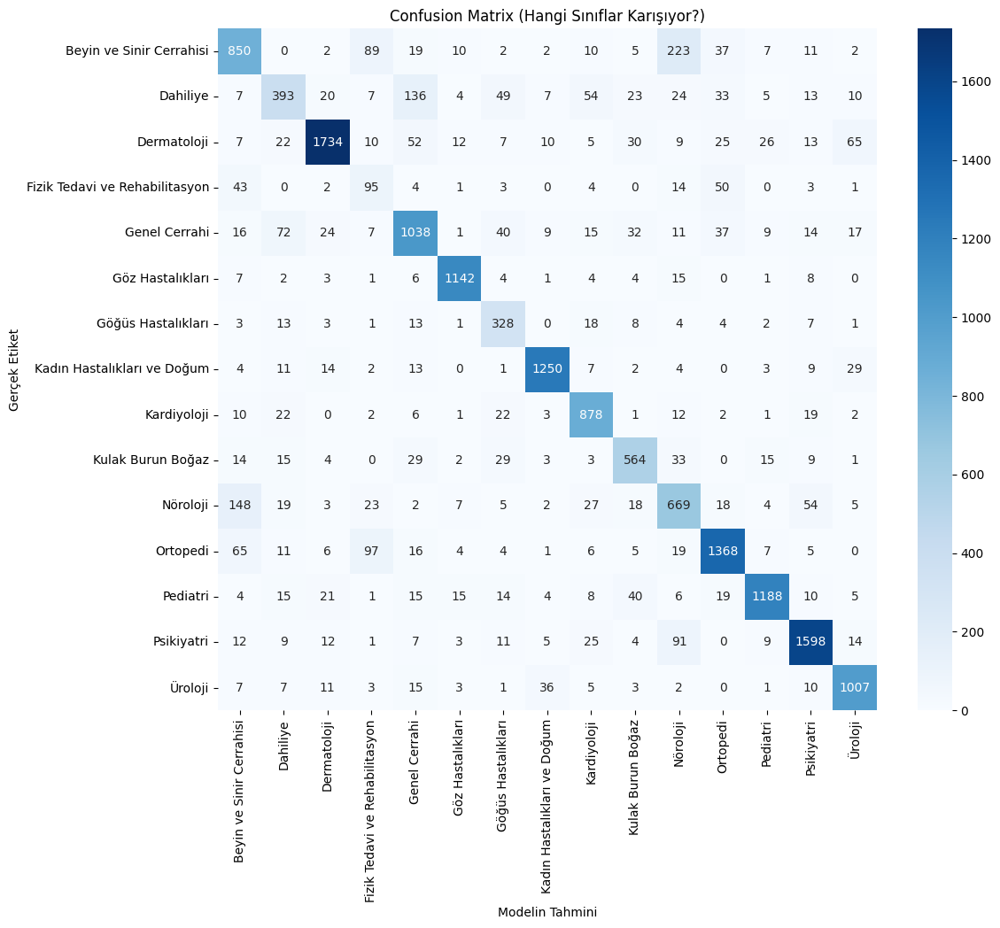

# med-AI-Training-for-Hospital-Project

## Projede Yapılacak İşlerin Sıralaması Şu şekildedir
#### 1.Fine-Tune edilecek ve projeye en uygun hazır bir model belirlemek.
#### 2.Seçilen model için veri seti hazırlamak
#### 3.Modeli eğitip gerçek uygulamada performansını test etmek.

## 1. Fine-Tune edliecek ve projeye en uygun hazır bir model belirlemek.

Bu aşamada bir kaç model üzerinde durdum ve en son BioBERTurk modeli üzerinde durdum. Bu model Türkçe tıbbi makaleler ile BERTurk modeli eğitilerek geliştirilmiş. Bende bu modeli Text-Classification yapabilmek için tekrardan eğitmeye karar verdim.

## 2. Seçilen model için veri seti hazırlamak

https://www.doktorsitesi.com sitesi üzerinden bölüm bazında yazılan hasta şikayetlerini yazdığım python script'i ile otomatik olarak çekiyorum. Yaklaşık 10 bölüm için var olan verileri toplayacağım. Hesaplarıma göre 300.000+ etiketli veri ile modeli eğitmeyi düşünüyorum.

Uzun süren veri toplama sürecinden ve temizlikten sonra topladığım veri sayısı etiketleriyle beraber aşağıda ki tabloda mevcut:

| Etiket                         | Sayı       |
|:-------------------------------|:-----------|
| Dermatoloji                    | 20267      |
| Psikiyatri                     | 18008      |
| Ortopedi                       | 16140      |
| Pediatri                       | 13648      |
| Kadın Hastalıkları ve Doğum    | 13494      |
| Genel Cerrahi                  | 13422      |
| Beyin ve Sinir Cerrahisi       | 12687      |
| Göz Hastalıkları               | 11979      |
| Üroloji                        | 11114      |
| Nöroloji                       | 10038      |
| Kardiyoloji                    | 9806       |
| Dahiliye                       | 7847       |
| Kulak Burun Boğaz              | 7215       |
| Göğüs Hastalıkları             | 4057       |
| Fizik Tedavi ve Rehabilitasyon | 2200       |
| **Toplam Veri Sayısı**         | **171922** |

Göündüğü üzere veri sayıları çok dağınık ve sentetik veri ile dengelenemeyek kadar büyük fark var. Ayrıca sentetik veri kullanmak istemediğimden bu sorunu algoritma seviyesinde çözmeye karar verdim. 
## 3.Modeli eğitip gerçek uygulamada performansını test etmek.

Bu aşamada en önemli kısım nasıl eğitileceği. Veri toplama aşamasında gördüğüm kadarıyla veri seti dengesiz olacak. Bu yüzden Ağırlıklı Hesaplama mantığını kullanacağım. Böylece modelin az veriye sahip etiketleride aynı oranda dikkate almasını sağlamak istiyorum. Modeli eğitmeye başladıktan sonra performansına göre metotlarımı geliştirecek/değiştireceğim.

### Modelin Confusion Matrix'i

Model genel olarak incelendiğinde iyi bir performans sergilediği görülebiliyor fakat bazı bölümlerde modelin çöktüğü görülebiliyor. Özellikle Fizik Tedavi ve Rehabilitasyon bölümünde başarısız bir model görülebiliyor. Bunun temel sebebi veri setinindeki bölümün az veri sayısı belirlenebilir.

Modelin başarılarından bahsedersek, birbirine yakın olan bölümleri ayrıştırmada başarı yakalamış. Örneğin Kardiyoloji ve Göğüs Hastalıkları bölümleri arasındaki ayrımı yakalayabilmiş. Göğüs Hastalıkları bölümünde az saydıda veri olmasına rağmen sınıflandırmayı başarılı bir şekilde yapabilmiş.

#### Modelin eğitim sırasındaki F1, Precision vb. değerleri: 

| Epoch | Training Loss | Validation Loss | Accuracy | F1 Macro | Precision |
| :---: | :---: | :---: | :---: | :---: | :---: |
| 1 | 0.680800 | 0.648317 | 0.810213 | 0.765823 | 0.763083 |
| 2 | 0.593000 | 0.624469 | 0.820218 | 0.775073 | 0.771048 |
| 3 | 0.423100 | 0.666773 | 0.816670 | 0.774901 | 0.774979 |
| 4 | 0.360500 | 0.740478 | 0.829640 | 0.788506 | 0.790792 |

10 Epoch olarak planlanan eğitim, Training Loss'un düşmeye devam etmesi ve Validation Loss'un aynı zamanda artmasına bağlı olarak durduruldu.